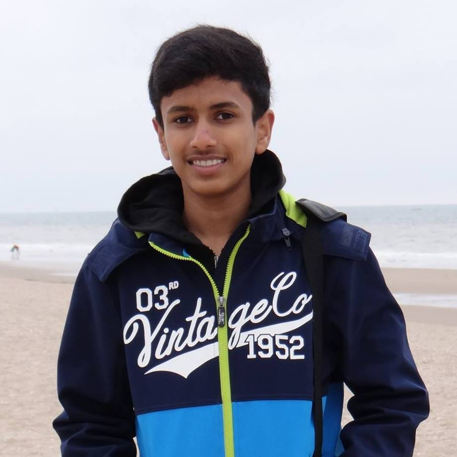
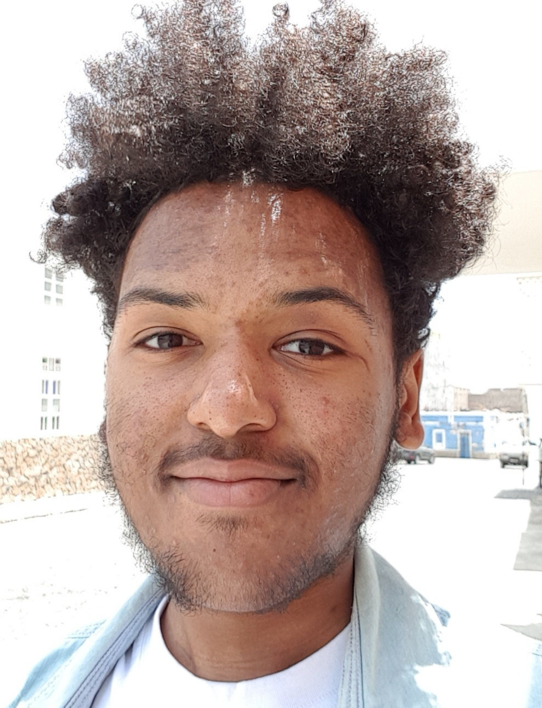

# TI1216 Template Repository

This a template repository to help you get started on making the best project possible!

You can download the latest version [here](https://github.com/SERG-Delft/TI1216/releases)

http://stackoverflow.com/a/6466993

## How to import into your IDE

Eclipse:
[http://javapapers.com/java/import-maven-project-into-eclipse/](http://javapapers.com/java/import-maven-project-into-eclipse/)

Intellij:  
[https://www.jetbrains.com/help/idea/2016.2/importing-project-from-maven-model.html](https://www.jetbrains.com/help/idea/2016.2/importing-project-from-maven-model.html)

## Getting your weekly reports

**Jacoco**:  
Run `maven install` ([Intellij](https://www.jetbrains.com/help/idea/2016.3/getting-started-with-maven.html#execute_maven_goal)/[Eclipse](http://imgur.com/a/6q7pV))

**Checkstyle**:  
Run `maven site`

Project Group:
------------------------    Sophie    ------------------------
NetID: sibbs
Student ID: 4940792
Picture: 

Part 1: Strengths / Weaknesses
	Strengths
		I don’t give up easily.
			Making sure that I finish my work, no matter how difficult / frustrating the work might be - using all resources I have at my disposal: team members, docs, any online resources

		I care about other people
			Checking to make sure that team members are coping with the workload - if they need help with anything making sure that everyone is able to hit deadlines, and making sure that the workload is balanced so as not to cause friction between team members.

	Weaknesses
		Personal expectations are too high / not able to recognise personal strengths
			Can spend a lot of time being self-critical of personal work even though it’s at the same level of other team members - wasting time / energy on things that are less pressing, focusing on the minutia rather than the big picture

		Overly Negative
			Tendency to focus on the negative rather than the positive of a situation / outcome even if the positives vastly outweigh the negatives. This can cause personal stress and put a strain on group dynamics / communication

Part 2: How I plan to GROW
	Learning Goal(s)
	Working on group communication so as to avoid causing conflict within the team due to previously mentioned 	weakness. Progression can be marked through the peer review process that will be used throughout the project - 	deadline of learning goal will be the end of the project.

	Reality
		It has been a long-standing goal of mine due to needing to be able to function in different environments with people from different backgrounds. This will be my first time working in such a large group - all my previous experience has been in much smaller groups / solo. So far I have worked in groups where I have either known one person within the group or everyone, being thrown into a completely new environment with completely new people has been difficult but given time to adjust it should work out well.

	Options
		The most important thing to do is to ask for feedback from other members within the group. The peer-review	system, while helpful and definitely provides some marker of progress, is only done once in a while. Personally asking other members of the team will provide a secondary opportunity for feedback but I think the set peer-review system will be most important. I personally struggle to ask questions and look for feedback when it comes to personal development of social skills as opposed to technical skills

	Will
		I’ll continue to communicate and make an effort to ask for feedback. This will be over the course of the project, so it might be a good idea to set points over the project to dedicate to helping the group with soft skills - communication in my case.

------------------------    Rohan   ------------------------
NetID: rdeshamudreshi
Student ID: 4831098
Picture: 

Part 1: Strengths / Weaknesses
    Strong Points
        I am committed and hardworking
            Example: Once I start something I cannot leave it unfinished. I will spend how much ever time is required to finish the task that I am working on
            In a team: It is important to finish what you are responsible for as otherwise it affects the whole team. 

        I can work well with a team
            Example: I play Cricket which is a team sport and requires coordination with other team members. 
            In a team: Teamwork is important in a big project as the tasks can be split well which increases efficiency and also have support from other members for areas where we may be struggling. 

    Weak Points
        I don’t like to ask others for help even if I may be struggling
            Example: If I am having an issue with something, I spend too much time on my own trying to figure out the solution for it rather than asking someone for help which can solve my problem much quicker.
            In a team: It is important to be time efficient and also make use of the knowledge of your other team members to get to a solution rather than struggling for a long time.

        I tend to procrastinate while I am working on something that I am not good at/ dislike
            Example: I was not really a fan of the CO course in Q1 and got distracted every 10-15 minutes while trying to study for it. I kept switching to youtube/games which meant I wasted time and kept procrastinating.
            In a team: If there is something I don’t like to do, maybe there is someone else who is better than me or likes doing it so the tasks can be assigned according to what we are good at and like to do.

Part 2: Goals
    Learning Goal:
        Get better at Java and coding in general
            Important: I am studying CS so it’s quite important that I get good at coding. 
            Success: I need to spend a lot of time practicing and creating some smaller projects of my own trying things out.

        Stay organized and plan well
            Important: It is important to stay organized as otherwise I may end up cramming everything last minute which will reduce the quality of what I am doing plus I may encounter some issues that require time to solve.
            Success: Make a plan and timetable and stick to it as much as possible. Make sure to keep it realistic and spread out the work over time.

        Communicate well with team mates
            Important: If two people are working on the same thing, it is a waste of time as that time could be used for something different.
            Success: Inform group about what I have worked on and what I am going to do next and make sure I know what they are working on

        Stick to a good sleep schedule
            Important: I won’t get tired during the day due to lack of sleep and will have more time and energy to work
            Success: Stop taking mid day naps and go to bed early and wake up early.

    Reality
        I am making sure I am prepared for group meetings and know what needs to be done next. 
        I need to spend more time working on my java coding skills 
        I tend to go to bed quite late which makes waking up early hard and makes me want to take naps during the day. I need to stick to a good sleep schedule so that I get good amount of time during the day to work.

    Options
        Options: go to bed on time, spend time working on Java, stick to planned timetable
        Use most: spend more time on coding Java, stick to schedule
        Stopping: don’t like java so I get distracted, lots of other things to do(study for Algo resits), partying with friends, playing games

    Will 
        To do: Find interesting projects to work on for Java, stick to timetable, stop procrastinating and stay focused, ask for help when needed
        First step: start doing work well in advance so I don’t cram it all in the last minute
        Teammates help: stay motivated, do their work on time, help each other when needed. 

            
------------------------    Marvin    ------------------------
Student ID: 4674138
Picture: 

Part 1: Strengths / Weaknesses
    
    Strong points
        Motivated to work
            Example: For linear algebra I always practice the things we did during the lecture that same day so I really understand
            In team: I will be motivated to do my part of that week which means others that need my work won’t have to wait too long.
        Eager to learn
            Example: When I get errors during programming I won’t give up immediately, but try and dig for that mistake and learn from it.
            In team: I will be more willing to ask for help when I’m stuck with something which means that that part of the project won’t be on hold for that long.
        
    Weak points
        I tend to procrastinate
            Example: When doing the weekly assignments for ADS I focused a lot with the analysis part and left the implementation part undone thinking I would do it later.
            In team: Others might have to wait longer for my part to be done if I procrastinate too long.
        Communication
            Example: When I need something or somebody else needs an answer from me, I tend to wait a lot before asking/answering.
            In team: This way certain parts of the project will be delayed which will then delay the whole project.
        
Part 2: Goals
    
    Learning goals
        Learn to communicate better
            Important: Good communication means that the project will elapse easier, as all members will stay up-to-date.
            Success: Whenever I need something or finished something, almost immediately let my teammates know.
        Try and learn things from others
            Important: Learning more things from others will give me more experience on that subject, and make me more willing to ask others for help
            Success: Whenever I’m stuck or find something someone is doing interesting, ask for help/explanations.
        Gain more experience in overall coding
            Important: Gaining more experience will make coding easier, which means that assignment may go easier or quicker.
            Success: Try and participate in as many parts of the projects to get some sort of understanding of those parts and gain more experience.
        
    Reality
        I now tend to ask questions more frequently when I’m in need of help, but also about things what others do.
        I can still improve my communication with others more. Whenever I have something on my mind, just say it out loud.
        
    Options
        Say the things I have on my mind, spend more time outside of this project on coding, be more social.
        Want I want to most is being more social.
        Taking the extra step to say something is stopping me now.
        
    Will
        I’m going to try and communicate as much as I can with my teammates during this project, but also after.
        I can start with some more coding outside of this project.
        My teammates can help me by being willing to give me these explanations or answers.

------------------------    Justin    ------------------------
NetID: jcysun
Student ID: 4698460
Picture: 

Part 1: Strengths / Weaknesses
    
    Strong points
        Motivated to learn
        I will be working hard on not only my part but also try to make some part of the others if I can, and even though it will
        be hard and maybe most of the stuff I won’t be able to understand, I will not give up so easily but putting a lot of 
        effort instead. I might not be a fast learner but I will definitely put a lot of effort in this group project.

        Communication
        Although I might not be a really talkative person, but I will certainly try to maintain good communication with each 
        other and 
        try not to trigger my group mates or even ease the conflict between others. For communication within the project, I will
        keep my groupmate in touch on the progress for the project.

        Working hard
        I am gonna put a lot of time on the project and to not only finish my part of work but try to do it to perfection if I 
        have time left. I will be really spending at least 13 hours per week on this project.
        
    Weak points
        Less programming experience

        Do not have much experience on programming. I am new to programming as I have never seriously have studied programming
        before this bachelor programme, so I actually just started to learn about programming for the OOP in the first quarter.  
        So I might encounter many new stuff in this project.

        Low efficiency

        My production with respect to the time I spent on my work is relatively low, so even though I spent a lot of time on my   
        own part I might not be able to produce as much as others, because I am not really a fast-learner.
        
Part 2: Goals
    
    Learning goals
        My learning goals for this project is that I could get way better on programming as I am at the moment. As I am learning 
        more and more new programming stuff, I hope I could also improve my speed on programming too.
        
        My other learning goal is that I hope I could make friends with everyone else in the group and will maintain a good 
        communication with the rest of the group, and even though we might conflict on some point, but I hope we will be able to 
        solve the problems in a smart way.
        
    Reality
        I have got to be working harder on improving my coding skill and get more experience since I do not have much.

        I have to improve my productivity on not only the project, but also on other courses so that I can spend more time on 
        this project as for the other courses I am still on track.

        Try to get to meeting on time and be well prepare for the meeting so that we could make good use of the meeting and be 
        able to ask the TA some solid questions.
    Options
        Try to work more as a group which we help each other among the group so that the productivity will be increased and our
        team working skills will be enhanced as well.

        Getting out of bed earlier so that even if we have some early meeting I would be well-prepared.
        
    Will
        I will be able to code pretty fluently after finishing the project or even in the middle of the project.

        I will be able to communicate with my groupmates very well and spend some good time with them.
